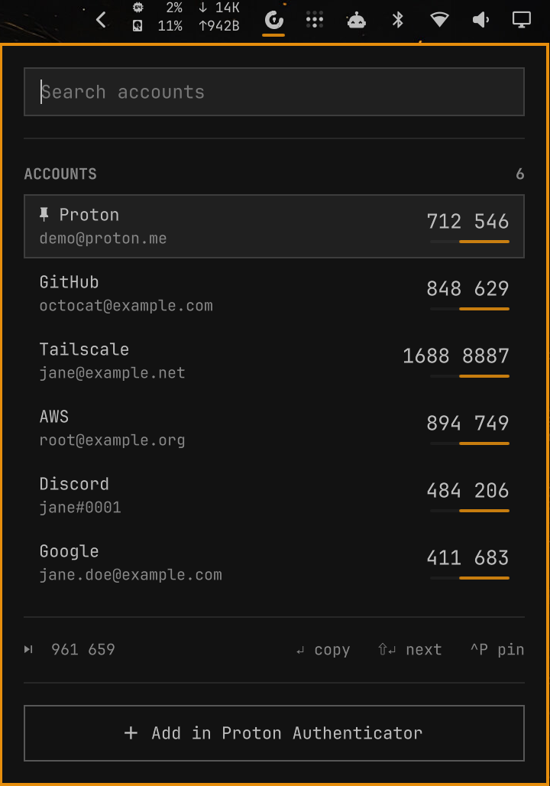

# Omarchy Proton Authenticator

Your [Proton Authenticator](https://proton.me/authenticator) 2FA codes in the
Omarchy bar. Open the panel, type a few letters, press Enter: the code is on
your clipboard. No app window, no network.

<p align="center"></p>

## Features

- **Launcher-style search.** The search field has focus as soon as the panel
  opens; Enter copies the top match.
- **Pinned and recent first.** Pin the accounts you use most; the rest are
  ordered by when you last copied them.
- **Next code too.** Shift+Enter copies the code for the next period, and the
  footer shows it for the selected account.
- **Follows your theme.** Built from the stock Omarchy panel parts, so colours,
  fonts and borders match the built-in panels.
- **Clipboard hygiene.** Codes are copied with `--sensitive` and cleared after
  20 seconds if they are still on the clipboard.
- **Light.** The vault is read about once every five minutes while the panel
  is open, not every second.

## Requirements

- [Omarchy](https://omarchy.org) with the Quickshell-based Omarchy shell
- Proton Authenticator for Linux (`proton-authenticator-bin` on the AUR),
  opened and signed in at least once so its vault and keyring entry exist
- `python-cryptography`, `python-pyotp` (vault decryption and TOTP)
- `libsecret` (`secret-tool`, to read the vault key from the keyring)
- `wl-clipboard`, `libnotify`

```sh
omarchy pkg add python-cryptography python-pyotp libsecret wl-clipboard libnotify
omarchy pkg aur add proton-authenticator-bin
```

## Install

```sh
omarchy plugin add https://github.com/navjottomer/omarchy-proton-authenticator.git --enable
```

This clones the plugin into `~/.config/omarchy/plugins/navjottomer.proton-authenticator/`,
validates it and puts it on the bar.

Optional hotkey — add to `~/.config/hypr/bindings.lua`:

```lua
o.bind("SUPER + CTRL + U", "Authenticator", "omarchy-shell shell toggle navjottomer.proton-authenticator")
```

## Update

```sh
omarchy plugin update navjottomer.proton-authenticator
```

## Remove

```sh
omarchy plugin remove navjottomer.proton-authenticator
```

If you added the hotkey, delete that line from `bindings.lua`. The plugin also
leaves a small state folder you can delete:
`~/.local/state/navjottomer.proton-authenticator/` (pinned accounts and
last-used times).

## Usage

Click the bar icon (or press your hotkey), then:

| Key | Action |
|---|---|
| type | filter accounts |
| Enter | copy the current code |
| Shift+Enter | copy the next code |
| Up/Down, Ctrl+J/K, PgUp/PgDn | move the selection |
| Ctrl+P, or right-click a row | pin or unpin |
| Tab / Shift+Tab | switch to the next bar panel |
| Esc | close |

Click a row to copy its code. Right-click the bar icon to reload from the
vault. The **Add in Proton Authenticator** button opens the app to add
accounts.

From scripts: `omarchy-shell navjottomer.proton-authenticator toggle`
(also `open`, `close`, `refresh`, `clearClipboard`).

## Settings

Set with `omarchy bar set navjottomer.proton-authenticator <key> <value>`:

| Key | Default | Meaning |
|---|---|---|
| `sortMode` | `recent` | order after pinned accounts: `recent` (last copied first, then A–Z), `alpha`, or `vault` (the app's order) |
| `closeOnCopy` | `true` | close the panel after copying |
| `notifyOnCopy` | `true` | show a notification naming the copied account |
| `clipboardClearSec` | `20` | seconds before a copied code is cleared from the clipboard (`0` = never) |
| `demoMode` | `false` | show fake accounts, for screenshots; never reads the vault |

## How it works

The panel never touches the vault itself. It runs `bin/protonauth-list`, a
small Python helper that:

1. makes a private read-only copy of Proton Authenticator's local database,
2. reads the vault key from the Secret Service keyring with `secret-tool`,
3. decrypts each entry (HKDF + AES-GCM) and computes its TOTP codes,
4. prints labels and the next 10 codes per account as JSON, then deletes its copy.

The panel picks the current code from its own clock and only runs the helper
again when the codes run low, about every five minutes.

## Privacy and security

- **No network.** Nothing is sent anywhere.
- **Secrets stay in the helper.** TOTP secrets never leave the short-lived
  helper process; the shell only ever holds labels and codes, and drops them
  when the panel closes.
- **Codes never on a command line.** Codes go to `wl-copy` on stdin, so they do
  not show up in `ps`.
- **The clipboard is never read into the shell.** Clearing checks the clipboard
  in a separate short-lived process (`bin/protonauth-clipcheck`), which only
  answers "match" or "no match".
- **Stored data.** Only pinned entry IDs and last-used times, in
  `~/.local/state/navjottomer.proton-authenticator/prefs.json`.
- Notifications show the account name; turn them off with
  `omarchy bar set navjottomer.proton-authenticator notifyOnCopy false`.

Like every Omarchy plugin, this runs as unsandboxed code in your shell. Review
it before installing.

## Troubleshooting

| Message | Fix |
|---|---|
| Open Proton Authenticator once… | the vault does not exist yet: open the app and sign in or add a code |
| Keyring is locked | unlock your login keyring and reopen the panel |
| Vault key not in keyring | open Proton Authenticator once so it stores its key |
| Missing dependency | install the packages under [Requirements](#requirements) |

If a change to the plugin does not show up, run `omarchy restart shell`.

## Credits

Forked from [mapski/omarchy.proton.auth.git-plugin](https://github.com/mapski/omarchy.proton.auth.git-plugin).
The vault reader (`bin/protonauth_list.py`) and clipboard check
(`bin/protonauth-clipcheck`) are based on that code; the panel is rewritten.

Proton and Proton Authenticator are trademarks of Proton AG. This project is
not affiliated with or endorsed by Proton.

## License

[MIT](LICENSE)
